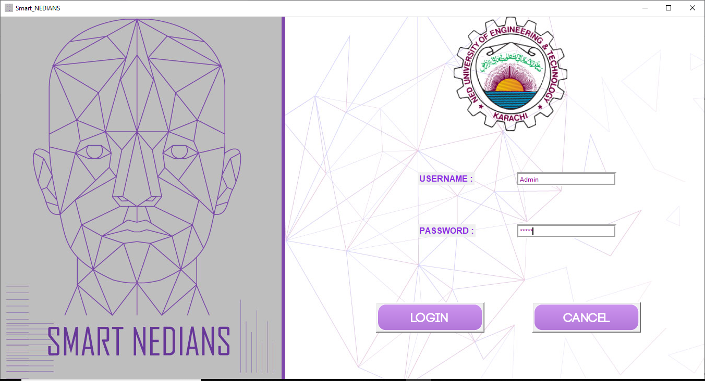
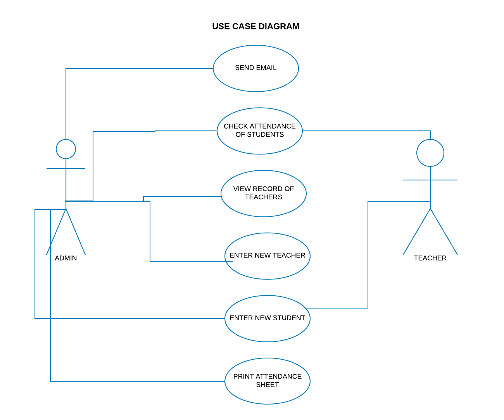

# FACE RECOGNITION BASED ATTENDANCE MANAGEMENT SYSTEM 

It is a university project, we have made a smart attendance system using tkinter for frontend interfacing and open-cv for face recognition.

## Contributors:
1) [Sumaiyya Sarfaraz](https://github.com/Summaiya1).
2) [Midha Tahir](https://github.com/MidhaTahir).

___
## Getting Started
Our system is divided into three windows:

1. Login 

From this login form, admin and teacher can login.
___
2. Admin

For admin login:

**USERNAME** : Admin

**PASSWORD** : 12345

We have added six buttons:

**Attendance Sheet** Button will display students’ attendance.

**Record** will display teachers record i-e their username and password.

**Enter New Record** will allow us to enter new teacher data.

**Send New Email** will send email to all absentees.

**Print Attendance** will send printing request and a text document will be printed.

**Exit** will exit from application.

___
3. Teacher 

For teacher login:

**USERNAME** : Sir Ali *(or choose any other from CSV)*

**PASSWORD** : ali123 

There are four main buttons in teacher’s form.

**View Attendance** will help the teacher to view attendance after facing recognized attendance is marked.

**Enter New Student** will open new student panel.

**Marking Attendance** will open a new window and it will then finally mark attendance based on the trained dataset and display student name also. Student will then be marked present in the CSV file too.

**Exit** will exit from application.

### Prerequisites

For open-CV installation:

```
pip install opencv-contrib-python
```

### Hardware 
1. Web Camera streams image or video
2. Printer used to give hardcopy of the attendance sheet

### Software and Libraries Used

1. Jupyter Notebook
2. Excel 
3. OpenCV 
4. Tkinter 
5. Numpy 
6. PIL
7. OS 
8. Pandas 
9. SMTP 
10. Regex 

### USE CASE DIAGRAM 

